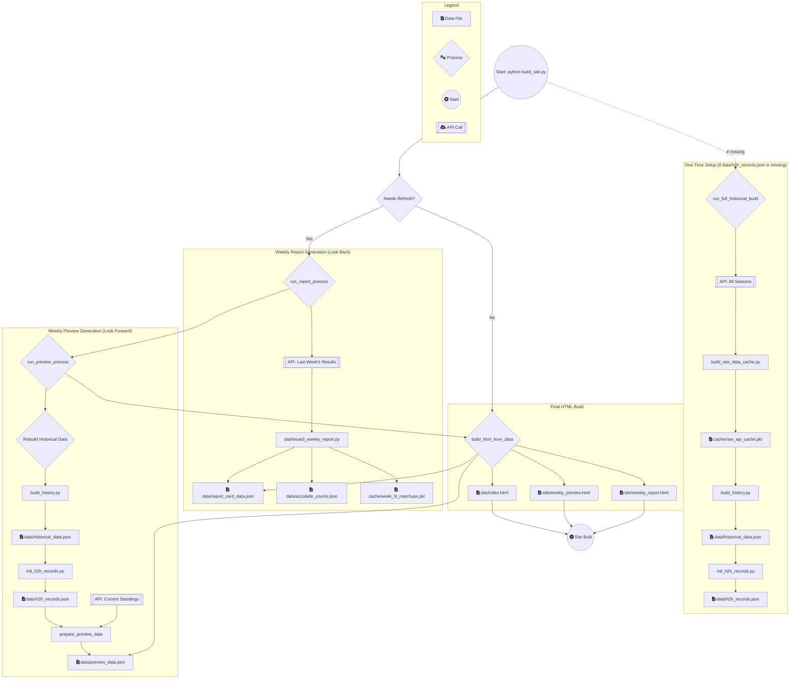

# 🏈 Y2K CPU Machinations - Statsbook 🏈

Welcome to the official statsbook for the Y2K CPU Machinations fantasy football league. This project automatically generates a static website with detailed weekly previews, report cards, and historical data, all wrapped in a glorious "Matrix" theme.

## Current Features

*   **Weekly Matchup Previews:** Automatically generates a `weekly_preview.html` page with upcoming matchups, including detailed head-to-head records (regular season, playoffs, and current streaks).
*   **Weekly Report Cards:** After a week is complete, a `weekly_report.html` page is generated with:
    *   An "Alternative Universe" standings table (based on median score).
    *   Weekly accolades like "Top Points," "Tough Luck Loss," and "Biggest Blowout."
*   **Interactive Placeholders:** The pages include UI for comments and reactions, ready to be wired up to a backend in the future.
*   **Automated Deployment:** Pushes to the `main` branch automatically build and deploy the site to GitHub Pages.
*   **Intelligent Build Process:** A single command (`python build_site.py`) is smart enough to know when a new week has been completed and will automatically refresh the data.

## Getting Started

Follow these steps to get the project running on your local machine.

### 1. Clone the Repository

```bash
git clone <your-repository-url>
cd Y2K-statsbook
```

### 2. Install Dependencies

This project uses `pipenv` to manage its virtual environment and dependencies.

```bash
pipenv install
```

This will create a `.venv` in your project directory and install the necessary packages (like `yfpy`).

### 3. Set Up API Credentials

The project needs Yahoo API credentials to fetch league data.

1.  Create a file named `.env` in the root of the project directory.
2.  Add your credentials to the file like this:

    ```
    YAHOO_CONSUMER_KEY="your-consumer-key-here"
    YAHOO_CONSUMER_SECRET="your-consumer-secret-here"
    ```

> **Note:** The `.gitignore` file is configured to prevent your `.env` file from ever being committed to the repository.

### 4. Run the Build Script

Activate the virtual environment and run the main build script.

```bash
# Activate the environment shell
pipenv shell

# Run the main build script
python build_site.py
```

The first time you run this, it will guide you through the Yahoo authentication process in your browser. It will then generate a `private.json` file to store your access token for future runs.

After the script finishes, you can find the generated website in the `site/` directory. Open `site/index.html` in your browser to view it.

## How to Use

*   **Normal Build:** To update the stats and rebuild the site, simply run `python build_site.py`. The script will automatically detect if a new week has been completed and refresh the data if needed.
*   **Forcing a Refresh:** If you are developing and want to force a full data refresh from the Yahoo API, use the `--force-refresh` flag:
    ```bash
    python build_site.py --force-refresh
    ```

*   `tools/`: Contains the modularized helper scripts for data processing.
*   `leagues.json`: The main configuration file defining league IDs for each season.

## Deployment

This project is configured for continuous deployment to GitHub Pages via GitHub Actions. The workflow is defined in `.github/workflows/deploy.yml`.

For the deployment to succeed, the GitHub Action needs to be able to authenticate with the Yahoo API on its own. This requires you to run the application **once** locally (or in a Codespace) to generate an authentication token, and then save your complete `.env` file content as a secret in your GitHub repository.

### Deployment Setup Steps

1.  **Run the app locally first:** Follow the "Getting Started" steps to run `python build_site.py` on your machine or in a Codespace. This will complete the OAuth2 flow and **update your `.env` file** with the necessary Yahoo access and refresh tokens.
    Your `.env` file should now look something like this (with actual values):
    ```
    YAHOO_CONSUMER_KEY="your-consumer-key-here"
    YAHOO_CONSUMER_SECRET="your-consumer-secret-here"
    YAHOO_ACCESS_TOKEN="your-access-token-here"
    YAHOO_REFRESH_TOKEN="your-refresh-token-here"
    YAHOO_TOKEN_EXPIRES_AT="your-token-expiration-timestamp-here"
    ```

2.  **Go to your GitHub repository's settings:** Navigate to `Settings > Secrets and variables > Actions`.

3.  **Create a new repository secret named `YAHOO_ENV_FILE`:**
    *   Open your `.env` file (the one updated in step 1).
    *   Copy its **entire content** (all lines, including consumer keys and tokens).
    *   Paste this entire content as the value for the `YAHOO_ENV_FILE` secret. Ensure it's a multi-line secret if your GitHub UI supports it, or just paste it as a single string if not (GitHub Actions `echo` command handles newlines).

Once this `YAHOO_ENV_FILE` secret is set, the GitHub Action will have everything it needs to run the build script and deploy the site automatically on every push to the `main` branch.

## Project Structure

*   `build_site.py`: The main entry point for the project.
*   `site/`: Contains the final, generated HTML website.
*   `data/`: Stores all the generated JSON data (H2H records, report card data, etc.).
*   `cache/`: Caches raw data from the API to speed up subsequent runs.
*   `tools/`: Contains the modularized helper scripts for data processing.
*   `leagues.json`: The main configuration file defining league IDs for each season.

## Project Architecture

The following flowchart illustrates the data pipeline for the statsbook, from fetching raw data to generating the final HTML pages.



## What's Next? The "D'OH!" Award

The next major feature on the roadmap is to implement one of the most coveted fantasy accolades: the **"D'OH!" Award**.

This will involve fetching player-level data for each team to calculate the "optimal" lineup for the week. We will then identify managers who lost but would have won if they had set their lineup optimally, immortalizing their poor coaching decisions in the weekly report.